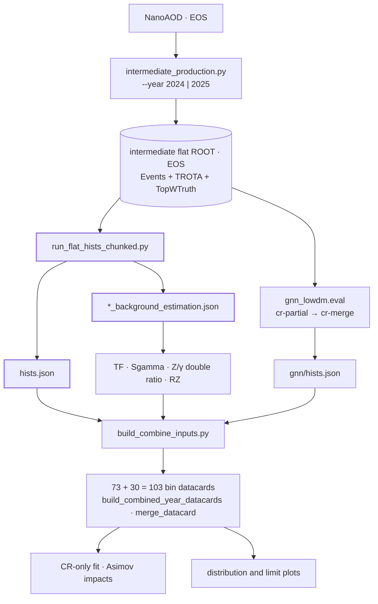

# Run-3 All-Hadronic Stop Analysis

2024+2025 · High-dM 79−6 = 73 bins + frozen Low-dM GNN 30 bins.

Development branch: `run3_full_analysis`.

- [High-dM canonical code](autonomous_allhad/reports/highdm_canonical_dependencies.md)
- [Low-dM canonical dependencies](autonomous_allhad/reports/lowdm_canonical_dependencies.md)
- [Current workflow locations](autonomous_allhad/reports/workflow_inventory.md)
- [Canonical histogram manifest](autonomous_allhad/reports/lepton_veto10_canonical_20260908.json)
- [Workspace, EOS and Git roles](WORKSPACE_LAYOUT.md)

## Pipeline

One ROOT pass produces both the High-dM histograms and the compact
`*_background_estimation.json` boundary. The TF, Sgamma, Z/gamma and RZ
measurements read that JSON only; they never reopen the intermediate ROOT or
NanoAOD. The SR stays blinded, so the fit stage is CR-only and Asimov impacts.

## Entry points

Thirteen commands in execution order. Everything else under `autonomous_allhad/`
is a library, a frozen batch-payload copy, or a historical one-off campaign
script.

| Stage | Entry point | Notes |
|---|---|---|
| 0 | `autonomous_allhad/intermediate_production.py` | `--year 2024\|2025`; Events, TROTA and Top/W truth in one batch job |
| 1A | `workflow/run_flat_hists_chunked.py` | `--campaign-year`, `--search-bin-config`; emits histograms and the background-estimation boundary |
| 1B | `python -m autonomous_allhad.gnn_lowdm.eval cr-partial` → `cr-merge` | frozen model `diagonal_v3_h48_l3_sig010`, epoch 17 |
| 2 | `workflow/build_histogram_tf_inputs_2024.py` `workflow/build_sgamma_ut_report_2024.py` `workflow/build_zgamma_double_ratio_2024.py` `python -m autonomous_allhad.dy_estimation build-measurement` | histogram-derived only |
| 3 | `workflow/build_combine_inputs.py` `workflow/build_combined_year_datacards.py` `gnn_lowdm/merge_datacard.py` | one shared card builder per year, not a copy per year |
| 4 | `workflow/run_cronly_fit_eos.sh` `workflow/run_asimov_impacts_eos.sh` | |
| 5 | `workflow/plot_control_search_bins_style.py` `workflow/postprocess_limits.py` `python -m autonomous_allhad.gnn_lowdm.plotting` | reads templates, not event ROOTs |

Shape systematic propagation runs separately in
`workflow/systematic_propagation/run.py`; it reads the intermediate ROOTs only
and does not read NanoAOD.

Commands are invoked two ways and the two are not interchangeable:
`autonomous_allhad.gnn_lowdm.*` resolves from the repository root, while
`autonomous_allhad.dy_estimation` and the other worker modules resolve with
`autonomous_allhad/` on `sys.path`.

## Execution contract

A campaign does not run the working tree. `run_flat_hists_chunked.py` freezes
the eight files listed in the campaign's `code_overlay.txt`, together with the
year's correctionlib payloads and the b-tag efficiency input, under recorded
SHA-256 sums and runs that snapshot. Editing a file locally does not change a
submitted campaign; the campaign has to be prepared again.

Every real invocation is recorded next to its output as `<stage>.argv`, so the
command behind a product is read from the campaign directory rather than
reconstructed.

## Runtime and policy

Analysis runtime: `/eos/user/t/taiwoo/miniconda3/envs/py38/bin/python`.
Batch analysis runtime: the existing `py38.tgz`; Combine uses the existing validated Combine runtime.

ROOT inputs and fit products remain on EOS. Local plotting uses compact exports.
Selections: lepton veto >10 GeV; DY dilepton mass 71–111 GeV; SR remains blinded.
Top/W truth augmentation is implemented in the main `flat_ntuple_worker.py`, in the existing intermediate ROOT; completion metadata update the existing production JSON.

Low-dM object and weight systematic variations are not yet propagated through
the GNN score and all SR/CR template migrations, so the combined Low-dM limits
remain preliminary.
