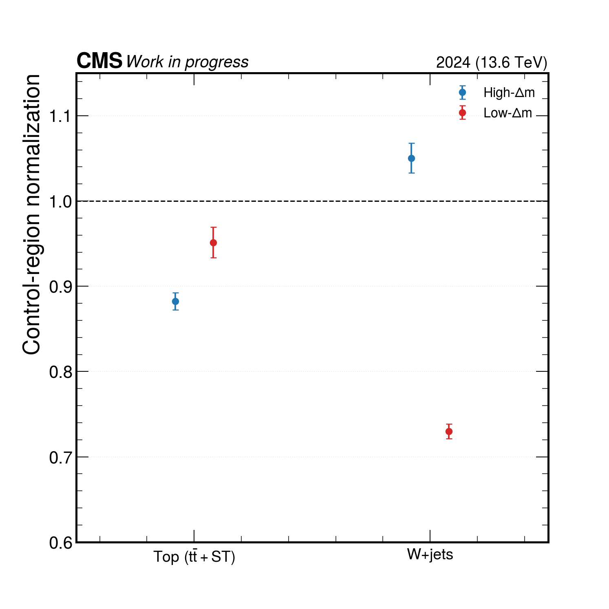
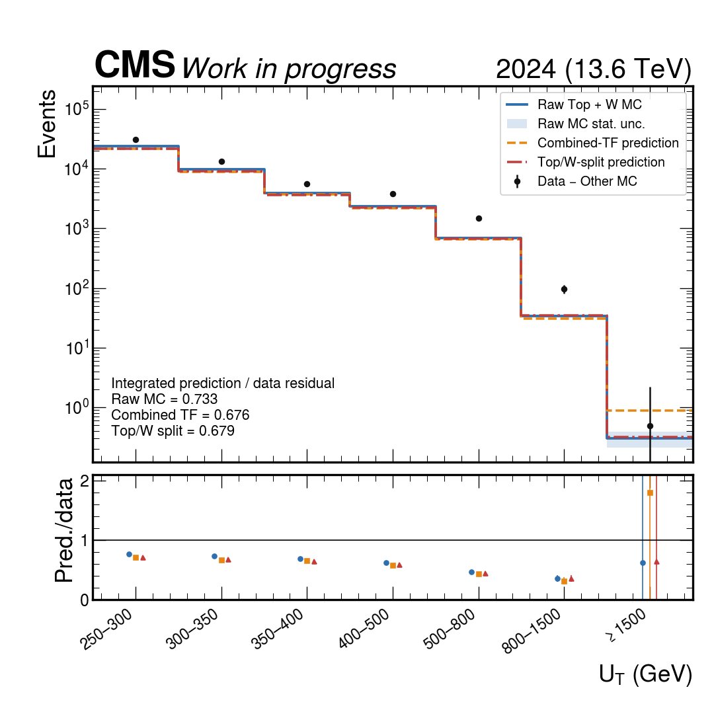
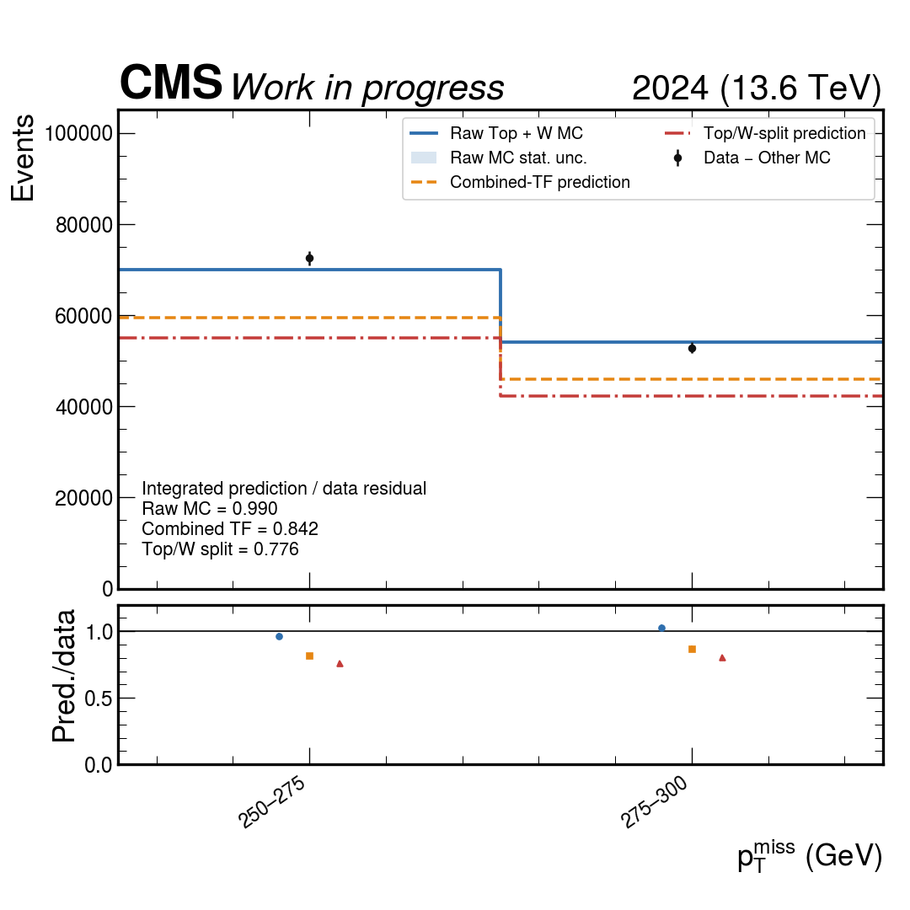
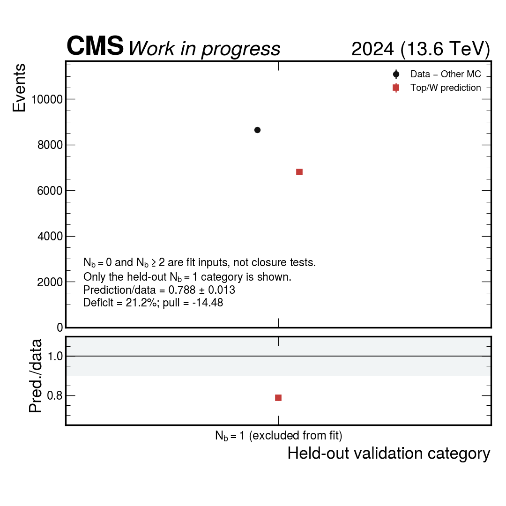
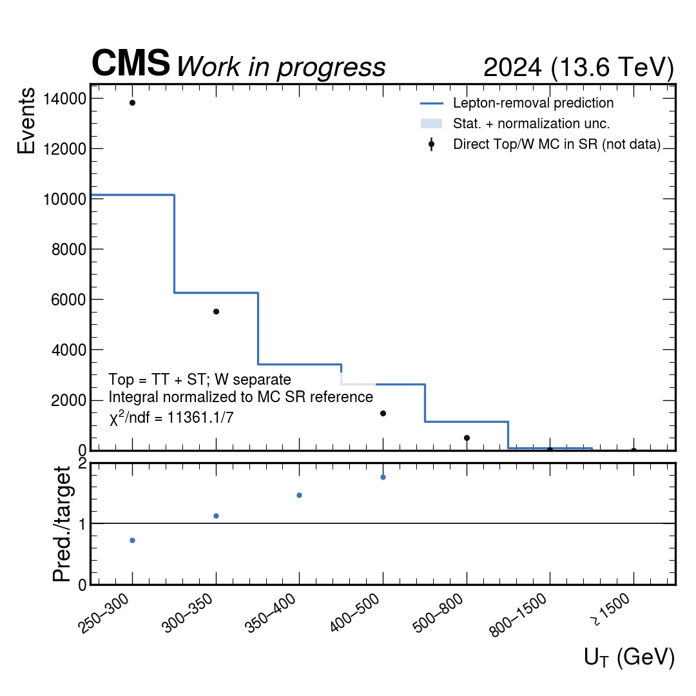
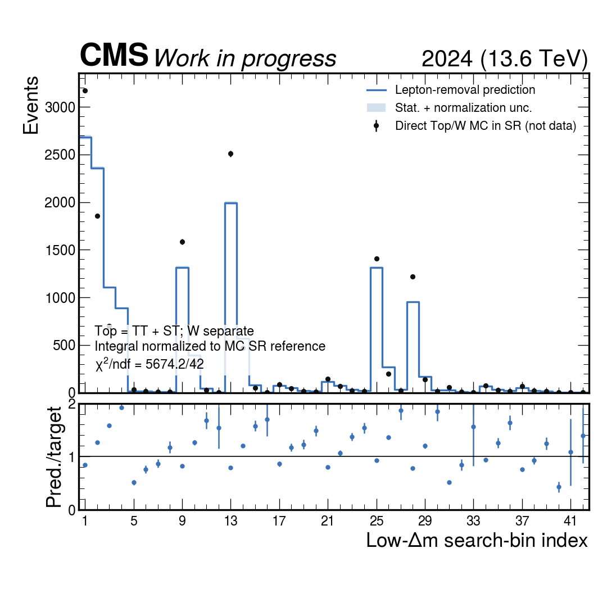
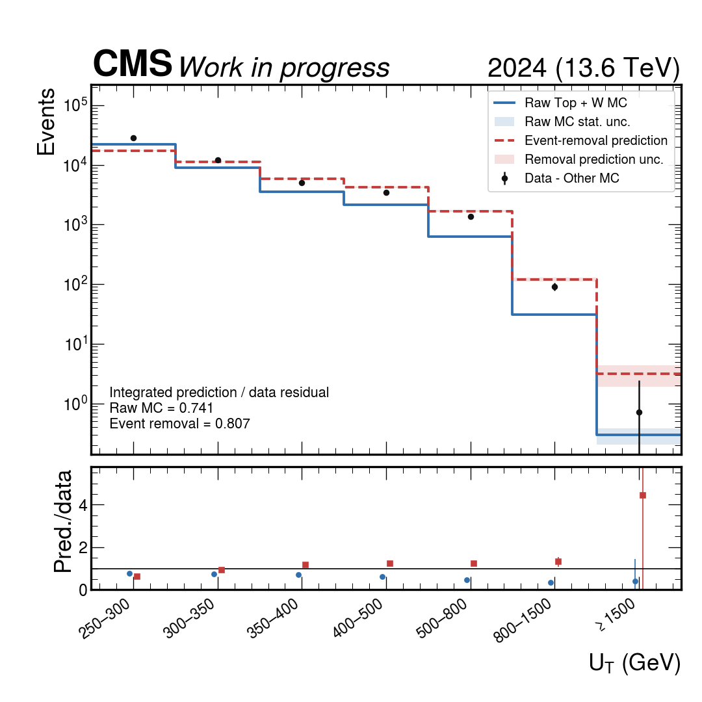
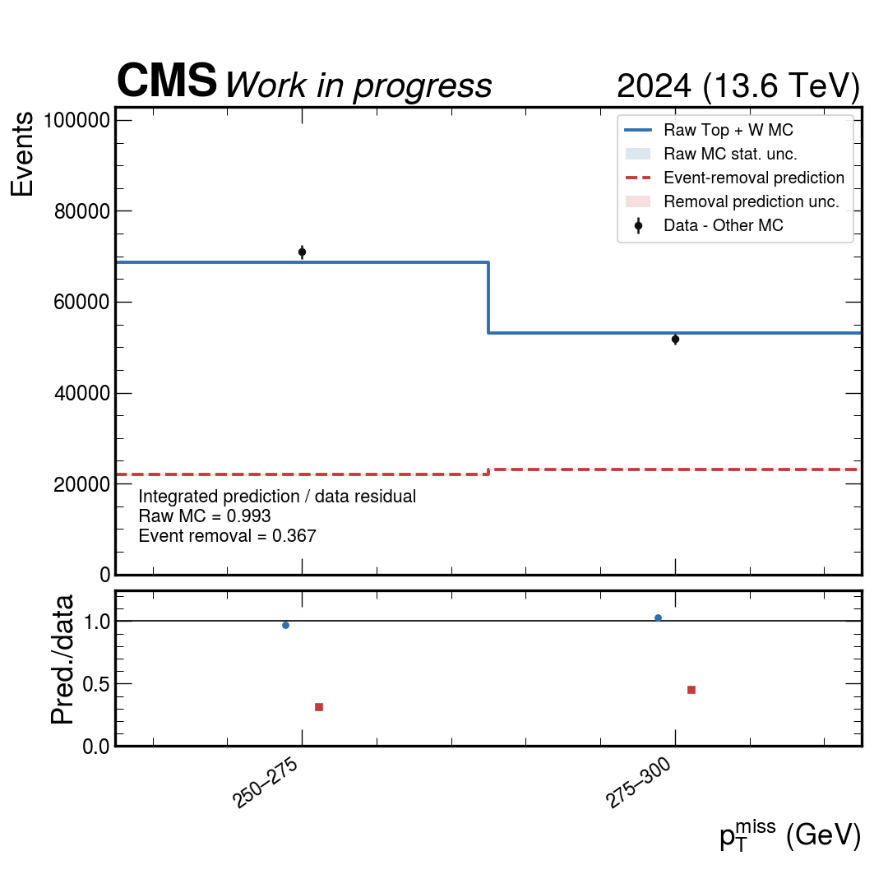

# 2024 Lost-lepton 배경추정 두 방법의 상세 비교

## 문서 목적과 최종 판정

이 문서는 2024 Run-3 all-hadronic stop 분석에서 지금까지 실제로 구현하고
검증한 두 lost-lepton 배경추정법을 하나의 일관된 기준으로 비교한다.

1. MC-derived LLCR-to-zero-lepton transfer factor
   - combined transfer factor
   - Top/W 분리 normalization 및 transfer
2. Data 1-lepton source를 이용한 event-level lepton-removal

두 방법 모두 현재 상태로는 nominal lost-lepton 배경추정에 채택하지 않는다.
그러나 실패의 성격은 다르다.

- Transfer-factor 방법은 구현, normalization, bin mapping과 MC 내부 closure는
  통과한다. 하지만 1-lepton CR에서 얻은 보정이 data zero-lepton validation
  region으로 전달되지 않는다.
- Event-level removal 방법은 residual normalization으로 적분수율을 맞춘 뒤에도
  MC의 \(U_{\mathrm{T}}\) 및 search-bin shape closure 자체가 크게 실패한다.
  따라서 data 적용 이전 단계에서 이미 단일 removal response가 부적절하다는
  증거가 있다.

모든 구현에서 process 정책은 다음과 같다.

\[
\mathrm{Top}=t\bar t+\mathrm{single\ top}, \qquad
\mathrm{W}=\mathrm{W+jets}.
\]

즉 `TT`와 `ST`는 항상 하나의 Top 성분으로 함께 움직이며, ST만의 독립
scale factor, transfer factor 또는 nuisance parameter는 없다.

## 공통 입력과 분석 보호 조건

| 항목 | Transfer-factor 연구 | Event-removal 연구 |
|---|---:|---:|
| 입력 flat ROOT | 1,153 | 1,153 |
| 읽은 이벤트 | 361,054,245 | 361,054,245 |
| closure/VR에 사용된 이벤트 | 34,735,958 | 38,634,909 |
| Data | JetMET | JetMET |
| Top | TT + ST | TT + ST |
| W | WtoLNu | WtoLNu |
| Other MC | Zto2Nu, DY, GJ, VV, QCD | Zto2Nu, DY, GJ, VV, QCD |
| Selection authority | `real_subset_worker.py` | `real_subset_worker.py` |
| Nominal 중간산출물 수정 | 없음 | 없음 |
| Nominal SR data | blinded | blinded |

Transfer-factor 연구와 event-removal 연구의 selected-event 수가 다른 것은 두
번째 연구가 migration 및 추가 validation sideband source event까지 저장하기
때문이다. 두 연구 모두 동일한 1,153개 입력 ROOT를 읽었다.

MC normalization은 physical dataset 전체의 generator sum of weights를
분모로 사용한다. 적용된 nominal weight에는 pileup, b tagging, electron ID,
muon ID correction이 포함된다. event split은 file 또는 shard 단위가 아니라
dataset ID와 run, luminosity block, event number로 만든 안정적인 event-level
hash를 사용한다.

---

## 방법 1: MC-derived transfer factor

### 1.1 기본 정의

가장 단순한 combined transfer factor는 bin \(i\)에서

\[
T_i^{\mathrm{comb}}
=
\frac{
N_{i,\mathrm{MC}}^{0\ell,\mathrm{Top+W}}
}{
N_{i,\mathrm{MC}}^{1\ell,\mathrm{Top+W}}
}
\]

로 정의한다. Data의 one-lepton control yield에서 비대상 배경을 차감한 뒤
이를 곱해 lost-lepton yield를 예측한다.

\[
\widehat N_{i}^{\mathrm{LL}}
=
T_i^{\mathrm{comb}}
\left(
N_{i,\mathrm{data}}^{1\ell}
-
N_{i,\mathrm{other\,MC}}^{1\ell}
\right).
\]

검증용 zero-lepton data에서는 같은 방식으로 Other MC를 차감한다.

\[
N_{i,\mathrm{obs}}^{\mathrm{LL}}
=
N_{i,\mathrm{data}}^{0\ell}
-
N_{i,\mathrm{other\,MC}}^{0\ell}.
\]

Closure observable은

\[
R_i=
\widehat N_i^{\mathrm{LL}}/N_{i,\mathrm{obs}}^{\mathrm{LL}}
\]

이며, 독립 validation region에서 unity와 양립해야 한다.

### 1.2 Top/W 분리 확장

Combined TF 실패가 Top과 W의 조성 차이 때문인지 검사하기 위해 두 성분을
분리했다. Top은 TT와 ST를 합친 하나의 template이다.

\[
\widehat N_{i}^{\mathrm{LL}}
=
\mu_{\mathrm{Top}}N_{i,\mathrm{MC}}^{0\ell,\mathrm{Top}}
+
\mu_{\mathrm W}N_{i,\mathrm{MC}}^{0\ell,\mathrm W}.
\]

High-\(\Delta m\)에서는 \(N_b=0\) W-enriched category와
\(3\leq N_j\leq4,\ N_b\geq1\) Top-enriched category를 사용한다.
Low-\(\Delta m\)에서는 \(N_b=0\) 및 \(N_b\geq2\) category를 fit anchor로
사용하고 \(N_b=1\)은 독립 validation으로 보존한다.

각 anchor는 순수한 한 과정이 아니므로 hard assignment 대신 다음 혼합
방정식을 푼다.

\[
\begin{pmatrix}
D_1-O_1\\
D_2-O_2
\end{pmatrix}
=
\begin{pmatrix}
T_1&W_1\\
T_2&W_2
\end{pmatrix}
\begin{pmatrix}
\mu_{\mathrm{Top}}\\
\mu_{\mathrm W}
\end{pmatrix}.
\]

여기서 \(D\)는 control data, \(O\)는 Other MC, \(T\)와 \(W\)는 각각 Top과
W MC yield다.

### 1.3 Fitted normalization

| Regime | \(\mu_{\mathrm{Top}}\) | \(\mu_{\mathrm W}\) | Correlation |
|---|---:|---:|---:|
| high-\(\Delta m\) | \(0.8823\pm0.0101\) | \(1.0504\pm0.0175\) | -0.659 |
| low-\(\Delta m\) | \(0.9514\pm0.0178\) | \(0.7300\pm0.0086\) | -0.083 |

High-\(\Delta m\)에서는 Top이 약 12% 감소하고 W가 약 5% 증가한다. 두 변화가
부분적으로 상쇄되어 combined TF와 Top/W-split 결과가 거의 같다.
Low-\(\Delta m\)에서는 W normalization이 약 27% 감소하고, 이것이 target
prediction을 크게 낮춘다.

### 1.4 MC technical closure

Target MC를 독립적인 A/B event-hash fold로 나눈다. A에서 측정한 TF로 B를
예측하고 B에서 측정한 TF로 A를 예측한 뒤 두 방향을 합친다.

| Distribution | 유효 bin | \(\chi^2/\mathrm{ndf}\) | 최대 \(|pull|\) |
|---|---:|---:|---:|
| high-\(\Delta m\) \(p_{\mathrm T}^{miss}\) | 6/7 | 0.0029/6 | 0.054 |
| high-\(\Delta m\) search bins | 29/60 | 0.0926/29 | 0.173 |
| low-\(\Delta m\) search bins | 36/42 | 0.1402/36 | 0.206 |

Full-mixture MC pseudodata closure도 최대 pull 0.19 이하로 통과한다. 이것은
software reduction, normalization bookkeeping, fold independence, bin mapping,
Other-MC subtraction이 내부적으로 일관됨을 보여준다. 그러나 양쪽 fold가 같은
generator model에서 왔기 때문에 simulation-to-data transfer를 검증하지는
않는다.

### 1.5 Data residual closure

| Validation region | Raw LL MC | Combined TF | Top/W split | Split max \(|pull|\) |
|---|---:|---:|---:|---:|
| high-\(\Delta m\), \(N_b=0\) | 0.644 | 0.653 | \(0.654\pm0.021\) | 14.51 |
| high-\(\Delta m\), Top enriched | 0.733 | 0.676 | \(0.679\pm0.008\) | 19.64 |
| low-\(\Delta m\), low ISR | **1.025** | 0.897 | \(0.800\pm0.013\) | 10.23 |
| low-\(\Delta m\), low \(p_{\mathrm T}^{miss}\) | **0.990** | 0.842 | \(0.776\pm0.014\) | 10.58 |
| low-\(\Delta m\), low MET significance | 1.133 | 1.020 | \(0.991\pm0.292\) | 0.42 |

High-\(\Delta m\)에서 Top/W 분리 전후 차이는 0.4 percentage point 이하다.
따라서 약 32-35% deficit은 Top/W를 합친 것만으로 설명되지 않는다.

Low-\(\Delta m\)의 low-ISR 및 low-\(p_{\mathrm T}^{miss}\) VR에서는 raw LL MC가
data residual과 각각 약 3%, 1% 수준에서 맞는다. 하지만 combined TF가 이를
0.897과 0.842로 이동시키고, Top/W split은 0.800과 0.776까지 더 악화시킨다.
이는 CR의 보정을 target에 전달하는 행위가 오히려 잘 맞던 분포를 망가뜨린
직접적인 사례다.

Low-MET-significance VR만 unity와 양립하지만 오차가 크고 target의 lost-lepton
purity가 낮다. 이 하나만 선택해 전체 방법을 정당화할 수 없다.

### 1.6 독립 control diagnostic

High-\(\Delta m\) anchor의 적분 yield는 두 미지수를 두 방정식으로 풀었기 때문에
정의상 맞는다. 그러나 W-enriched anchor의 shape p-value는
\(7.95\times10^{-4}\), 최대 pull은 3.55다. Top-enriched shape는
p-value 0.483, 최대 pull 1.47로 상대적으로 양호하다.

Low-\(\Delta m\)에서 fit에 쓰지 않은 \(N_b=1\) category는

- prediction: \(6814.8\pm81.2\)
- data residual: \(8649.9\pm97.3\)
- prediction/residual: \(0.7878\pm0.0129\)
- pull: -14.48

이다.

**\(N_b=0\)과 \(N_b\geq2\)는 scale factor를 결정한 fit 입력이므로 이 두
category에서 예측이 data와 맞는 것은 closure evidence가 아니다. 새 그림은
오해를 피하기 위해 유일한 독립 검정인 \(N_b=1\)만 표시한다.**

따라서 두 전역 normalization은 서로 다른 \(N_b\) category를 동시에 설명하지
못한다. 가능한 원인은 recoil-dependent W modeling, b-tag 및 \(N_b\) migration,
Top 내부 TT/ST composition, lepton 효율과 hadronic activity의 상관관계다.

### 1.7 Transfer-factor uncertainty

현재 통계 모델에는 다음이 포함된다.

- Data control 및 validation count의 Poisson variance
- weighted MC template의 sum-of-weights-squared
- Other-MC subtraction variance
- \(\mu_{\mathrm{Top}}\), \(\mu_{\mathrm W}\) covariance와 bin 간 상관
- 독립 A/B-fold TF의 통계 covariance

아직 포함되지 않은 항목은 다음과 같다.

- lepton trigger, reconstruction, ID, isolation의 detector systematic
- b tagging 및 \(N_b\) migration systematic
- recoil 및 process modeling systematic
- TT/ST와 Top/W 세부 조성 uncertainty
- Other-MC normalization/shape systematic
- signal contamination

하지만 관측된 실패는 10-20 sigma 수준의 coherent discrepancy이며, low-dM에서는
raw MC보다 방향 자체가 나빠진다. 단순히 더 큰 systematic을 붙여 nominal
방법으로 유지하는 것은 정당하지 않다.

### 1.8 방법 1 판정

- 구현 및 normalization sanity check: 통과
- MC fold closure: 통과
- full-mixture MC closure: 통과
- data residual closure: 실패
- Top/W 분리의 개선: 없음
- nominal central value로 채택: 불가

---

## 방법 2: Event-level lepton removal

### 2.1 동기

Transfer factor는 CR의 process mixture와 recoil mismatch를 MC 비율로 target에
전달한다. 이를 줄이기 위해 실제 Data 1-lepton event의 hadronic system,
\(N_j\), \(N_b\), recoil 구조를 그대로 사용하고 lepton만 잃어버린 것처럼
변환하는 event-level 방법을 시험했다.

### 2.2 Event transformation

선택된 electron 또는 muon의 transverse momentum을 missing momentum에 더한다.

\[
\vec p_{\mathrm T}^{\,miss,rem}
=
\vec p_{\mathrm T}^{\,miss}
+
\vec p_{\mathrm T}^{\,\ell}.
\]

이후 수정된 momentum으로 다음을 다시 계산한다.

- \(p_{\mathrm T}^{miss}\) 및 \(U_{\mathrm T}\)
- jet-\(p_{\mathrm T}^{miss}\) \(\Delta\phi\)
- high-\(\Delta m\) SR selection 및 60 search bins
- low-\(\Delta m\) ISR selection, MET significance 및 42 search bins
- 다섯 개 orthogonal validation regions

Top과 W는 독립 residual lost/pass normalization을 갖지만
\(\mathrm{Top}=\mathrm{TT+ST}\) 정의는 유지한다.

### 2.3 Residual normalization과 Data prediction

MC component \(c\)에 대해 removal source \(R_{c,i}\)와 truth-leptonic
zero-lepton target \(L_{c,i}\)의 적분비로

\[
\alpha_c
=
\frac{\sum_i L_{c,i}}{\sum_i R_{c,i}}
\]

를 구한다. Event-hash A/B fold에서 한 fold의 \(\alpha\)로 다른 fold를
예측하는 cross-fit을 사용한다.

| Regime | Component | \(\alpha\) |
|---|---:|---:|
| high-\(\Delta m\) | Top = TT + ST | \(0.3663\pm0.0010\) |
| high-\(\Delta m\) | W | \(0.5297\pm0.0113\) |
| low-\(\Delta m\) | Top = TT + ST | \(0.2823\pm0.0015\) |
| low-\(\Delta m\) | W | \(0.3134\pm0.0021\) |

Data VR의 effective factor는 fitted Top/W mixture를 사용한다.

\[
k_i=
\frac{
\mu_{\mathrm{Top}}\alpha_{\mathrm{Top}}R_{\mathrm{Top},i}
+
\mu_{\mathrm W}\alpha_{\mathrm W}R_{\mathrm W,i}
}{
\mu_{\mathrm{Top}}R_{\mathrm{Top},i}
+
\mu_{\mathrm W}R_{\mathrm W,i}
}.
\]

최종 Data prediction은

\[
\widehat N_i^{\mathrm{LL}}
=
k_i
\left(
N_{i,\mathrm{data}}^{1\ell,\mathrm{rem}}
-
N_{i,\mathrm{other\,MC}}^{1\ell,\mathrm{rem}}
\right)
\]

이다.

### 2.4 MC cross-fit shape closure

\(\alpha\)가 적분 target/source ratio로 정의되므로 총수율은 거의 정확히 1이
되도록 강제된다. 따라서 이 방법의 유효성은 적분비가 아니라 shape
\(\chi^2\)와 bin pull로 판정해야 한다.

| Distribution | Removal \(\chi^2/\mathrm{ndf}\) | Removal max \(|pull|\) | TF reference \(\chi^2/\mathrm{ndf}\) | TF max \(|pull|\) |
|---|---:|---:|---:|---:|
| high-\(\Delta m\) 60 bins | 13362.7/60 | 51.08 | 3.899/58 | 1.19 |
| high-\(\Delta m\) \(U_{\mathrm T}\) | 11361.1/7 | 57.71 | 0.004/7 | 0.05 |
| low-\(\Delta m\) 42 bins | 5674.2/42 | 45.32 | 0.175/42 | 0.21 |

두 그림의 direct zero-lepton target은 실제 Data가 아니라 각각 high-\(\Delta m\)
SR과 low-\(\Delta m\) SR을 직접 통과한 Top/W MC reference다. Nominal SR
Data target histogram은 코드에서 강제로 비워 blinding을 유지했다.

High-\(\Delta m\) \(U_{\mathrm T}\)에서 removal prediction은 첫 bin에서 target보다
작고 중간 \(U_{\mathrm T}\)에서 크게 과대예측한다. 이는 단일 \(\alpha\)로 보정할
수 없는 migration/response shape failure다. 더 엄격한 source selection을
사용한 strict variant는 오히려 더 나빴다.

### 2.5 Data validation

Data-driven prediction이 raw MC와 다른 것은 그 자체로 실패가 아니다. 동일한
selection에서 Data-Other MC residual에 더 가까워지는지를 기준으로 판단한다.

| Validation region | Raw Top+W MC | Removal | Removal max \(|pull|\) |
|---|---:|---:|---:|
| high-\(\Delta m\), \(N_b=0\) | 0.644 | 0.598 | 16.06 |
| high-\(\Delta m\), Top enriched | 0.741 | 0.807 | 23.42 |
| low-\(\Delta m\), low ISR | 1.026 | 0.542 | 23.25 |
| low-\(\Delta m\), low \(p_{\mathrm T}^{miss}\) | 0.993 | 0.367 | 30.92 |
| low-\(\Delta m\), low MET significance | 1.140 | 0.273 | 2.72 |

High-\(\Delta m\) Top-enriched VR은 적분비가 raw MC 0.741에서 removal
0.807로 unity에 가까워진다. 그러나 최대 pull은 raw MC 14.83에서 removal
23.42로 증가한다. 따라서 이것은 shape closure 개선이 아니다.

나머지 네 VR은 적분비도 악화된다. 특히 low-MET VR은 raw MC 0.993에서
0.367, low-ISR VR은 raw MC 1.026에서 0.542로 크게 낮아진다.

### 2.6 Removal uncertainty

현재 prototype은 다음 통계항을 전파한다.

- Data removal source와 Other-MC source의 통계 variance
- Top/W removal-source MC의 sum-of-weights-squared
- \(\alpha_{\mathrm{Top}}\), \(\alpha_{\mathrm W}\) variance
- fitted \(\mu_{\mathrm{Top}},\mu_{\mathrm W}\) covariance
- zero-lepton validation residual의 Data 및 Other-MC variance

현재 flat payload에서 \(\alpha\)와 같은 source histogram의 상관은 복원할 수
없어 포함하지 않았다. Absolute lepton-loss efficiency payload, detector/model
systematic, tau response도 아직 없다.

### 2.7 실패의 물리적 원인

단일 four-vector removal은 모든 lost-lepton event를 lepton이 detector에서
완전히 invisible했던 event처럼 취급한다. 실제 lost-lepton background에는
다음이 섞여 있다.

- detector acceptance 밖의 lepton
- reconstruction failure
- ID 또는 isolation failure
- hadronic tau decay

Acceptance/reconstruction loss에는 removal-like response가 합리적일 수 있다.
하지만 ID/isolation에 실패한 electron/muon의 PF momentum은 event에 상당 부분
남아 있을 수 있다. 이 경우 momentum 전체를 \(p_{\mathrm T}^{miss}\)에 더하면
recoil과 \(\Delta\phi\) migration을 과도하게 만든다.

또 하나의 입력 한계가 있다. 현재 flat preselection은 보통의 1-lepton event에
대해 원래 \(p_{\mathrm T}^{miss}>250\) GeV를 요구한다. 따라서 removal 후
threshold 위로 이동할 원래 \(p_{\mathrm T}^{miss}<250\) GeV event를 사용할 수
없다. 이는 특히 low-\(\Delta m\) threshold region의 절대 예측을 낮추는 방향의
bias를 만든다.

### 2.8 방법 2 판정

- event-level migration 구현: 완료
- Top = TT + ST 정책: 확인
- MC 적분 normalization: 정의상 통과
- MC shape closure: 실패
- data VR closure: 실패
- nominal central value로 채택: 불가

---

## 두 방법의 직접 비교

| 판정 항목 | Transfer factor | Event-level removal |
|---|---|---|
| Data 1-lepton 정보를 사용 | 예 | 예 |
| Hadronic event shape를 event-by-event 유지 | 아니오 | 부분적으로 예 |
| Top = TT + ST, W 독립 | 예 | 예 |
| MC technical closure | 통과 | shape 실패 |
| Data residual closure | 실패 | 실패 |
| Low-dM raw MC 대비 | 종종 악화 | 더 크게 악화 |
| 핵심 failure | CR correction의 target 비이식성 | 잘못된 단일 detector response와 입력 migration 손실 |
| 현재 채택 여부 | 폐기 | 폐기 |

Transfer factor는 최소한 MC 내부 technical closure를 통과하므로 구현 진단용
archive로 가치가 있다. 반면 현재 removal prototype은 MC shape 단계에서
실패하므로 data-driven estimator의 central value 후보가 될 수 없다.

두 결과가 공통으로 말하는 것은 단순하다. Lost-lepton background는 하나의
global process normalization이나 하나의 universal removal response로 설명되지
않는다. Lepton loss mode, flavor, hadronic activity, \(N_b\), recoil 및 process
mixture의 상관을 모델에 직접 넣어야 한다.

## 권고하는 다음 추정법

다음 iteration은 hybrid efficiency/response embedding이어야 한다.

1. Data electron 및 muon 1-lepton source를 분리한다.
2. Top은 TT+ST로 함께 움직이고 W만 독립 성분으로 유지한다.
3. Acceptance, reconstruction, ID, isolation loss 확률을
   \(p_{\mathrm T}^{\ell},\eta^\ell,N_j,N_b,H_{\mathrm T}\)의 함수로 측정한다.
4. Acceptance/reconstruction loss에만 removal/embedding response를 사용한다.
5. ID/isolation loss에는 PF momentum이 남는 detector response template를
   적용한다.
6. Hadronic tau를 독립 auxiliary component로 처리한다.
7. 원래 MET가 아니라 1-lepton recoil을 기준으로 source input을 materialize하여
   below-threshold migration을 보존한다.
8. MC truth closure, electron/muon split closure, held-out \(N_b\) category 및
   다섯 data VR을 모두 adoption gate로 사용한다.
9. Raw MC, 기존 TF, 새 hybrid estimator를 같은 valid-bin mask에서 비교한다.
10. 모든 gate를 통과하기 전에는 nominal datacard central value를 변경하지 않는다.

## 최종 분석 결정

1. Combined TF와 Top/W-split TF를 nominal에서 폐기한다.
2. 현재 monolithic event-removal estimator도 nominal에서 폐기한다.
3. 두 구현과 모든 JSON/plot은 failed-method diagnostic으로 보존한다.
4. Raw LL MC는 임시 reference일 뿐 validated final estimate로 주장하지 않는다.
5. Hybrid efficiency/response embedding이 독립 validation에서 raw MC보다
   개선될 때만 새로운 nominal method로 채택한다.

## 재현성 자료

- Transfer-factor machine-readable result:
  `../lost_lepton_top_w_split_closure_2024_20260728/top_w_closure.json`
- Transfer-factor MC closure:
  `../lost_lepton_closure_2024_20260728/mc_closure.json`
- Event-removal machine-readable result:
  `../lost_lepton_removal_closure_2024_20260728/removal_closure_results.json`
- Event-removal run manifest:
  `../lost_lepton_removal_closure_2024_20260728/inputs/run_manifest.json`
- Selection authority:
  `autonomous_allhad/autonomous_allhad/real_subset_worker.py`
